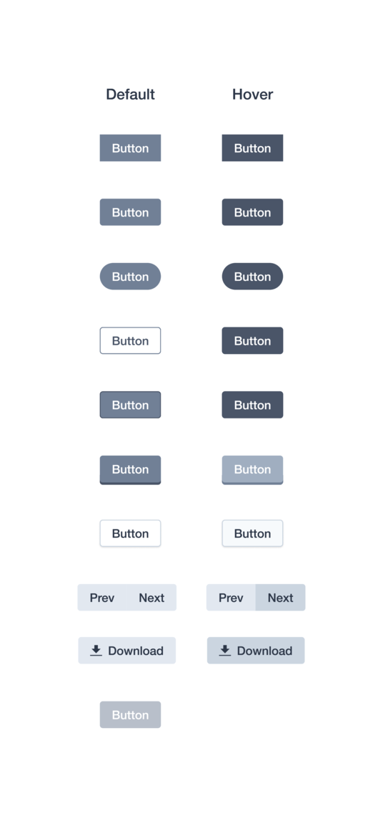

# Figma Kit for TailwindCSS

    

## Information

**Click the Image to get to the Project**

Alternatively this repo also contains a _periodically updated_ **.fig** file that can be imported into Figma.

This will be my **finished** version for now. Feel free to make issues for suggestions / better practises

## Screenshots

    
    
    
    
    
    
    
    
    
    
    
    
    

