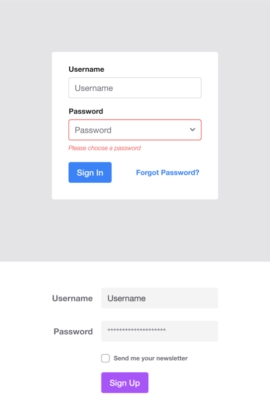
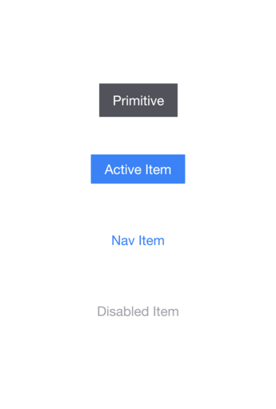

# Figma Kit for TailwindCSS

    

## Information

**Click the banner or [here](https://www.figma.com/c/file/768809027799962739) to get to the project**

**Limitations**

- Font styles need to be overwritten separately
- Figma does not support spread shadow styles

**Changelog (dd/mm/yy)**:

- 04.01.20: Update to Auto Layout

Alternatively this repo also contains a _periodically updated_ **.fig** file that can be imported into Figma.

Need an easy way to import tailwind config styles? Check my [Figma Plugin](https://www.figma.com/c/plugin/738806869514947558/Tailwind-CSS)

Icons: [Heroicons UI by Steve Schoger](https://github.com/sschoger/heroicons-ui)

## Support for new projects? (optional)

## Screenshots

### Colors

    

### Typography

    

### Shadows

    

### Buttons

    

### Pills

    

### Input

    

### Container

    

### Spacing

    

### Grid

    

### Alerts

    

### Cards

    

### Forms

    

### Navigation

    

### Icons

    

