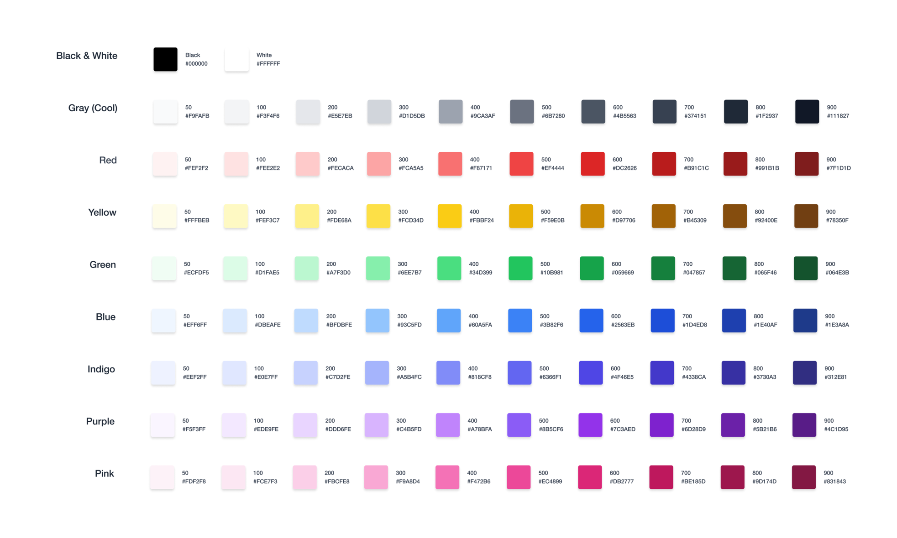
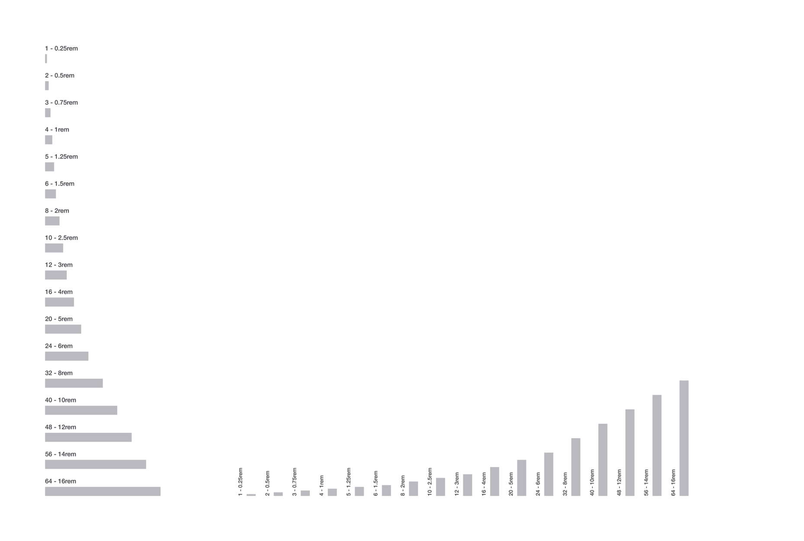

# Figma Kit for TailwindCSS

    

## Information

**Click the Image to get to the Project**

Alternatively this repo also contains a _periodically updated_ **.fig** file that can be imported into Figma.

This will be my **finished** version for now. Feel free to make issues for suggestions / better practises.

Icons: [Heroicons UI by Steve Schoger](https://github.com/sschoger/heroicons-ui)

## Screenshots

<!-- Colors -->

    

<!-- Typography -->

    

<!-- Alerts -->

    

<!-- Buttons -->

    

<!-- Pill -->

    

<!-- Cards -->

    

<!-- Forms -->

    

<!-- Navigation -->

    

<!-- Icons -->

    

<!-- Shadows -->

    

<!-- Container -->

    

<!-- Spacing -->

    

<!-- Grid -->

    

