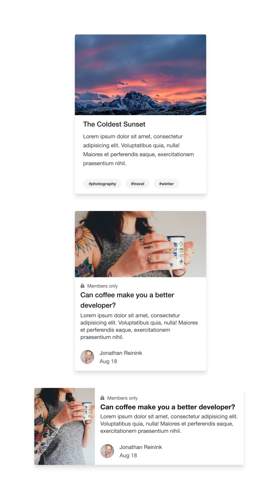
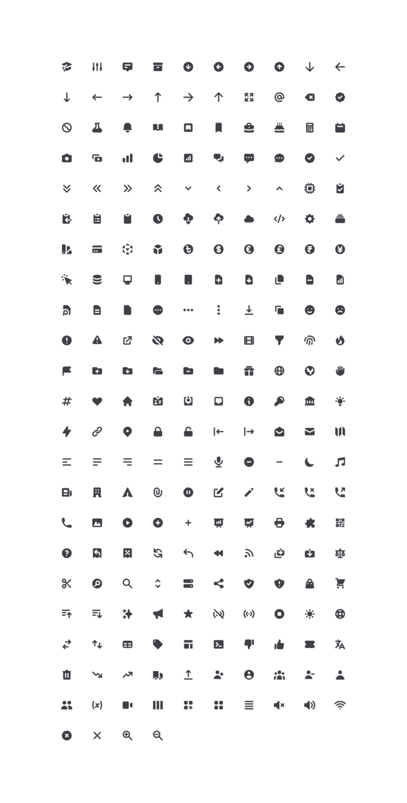

# Figma Kit for TailwindCSS

    

## Information

**Click the banner or [here](https://www.figma.com/c/file/768809027799962739) to get to the project**

**Limitations**

- Font styles need to be overwritten separately
- Figma does not support spread shadow styles

**Changelog (dd/mm/yy)**:

- 24.11.2020: Update to Tailwind v2 colors
- 10.08.2020: Update Heroicons
- 30.07.2020: Add TailwindUI colors
- 19.07.2020: Rename default colors
- 25.04.2020: Update Heroicons
- 12.04.2020: Fix line-height
- 27.02.2020: Update Heroicons
- 04.01.2020: Update to Auto Layout

Alternatively this repo also contains a **.fig** file that can be imported into Figma.

Need an easy way to import tailwind config styles? Check my [Figma Plugin](https://www.figma.com/c/plugin/738806869514947558/Tailwind-CSS)

Icons included: [Heroicons UI by Steve Schoger and Adam Wathan](https://github.com/refactoringui/heroicons)

## Screenshots

### Colors

    

### Typography

    

### Buttons

    

### Pills

    

### Input

    

### Shadows

    

### Navigation

    

### Forms

    

### Alerts

    

### Cards

    

### Heroicons Outline

    

### Heroicons Solid

    

### Container

    

### Spacing

    

### Grid

    

